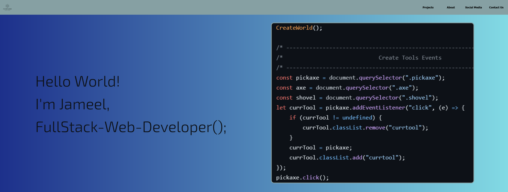
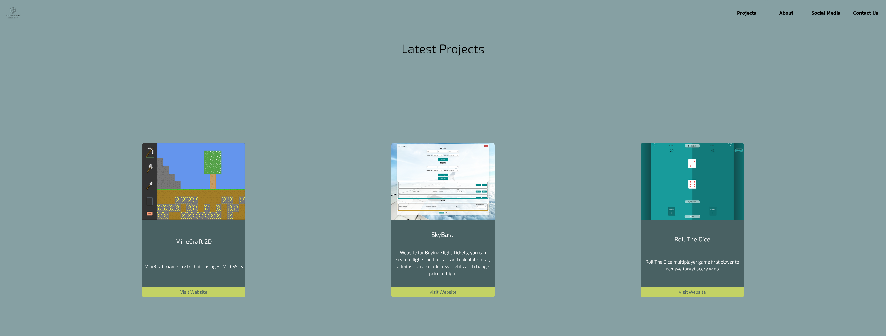
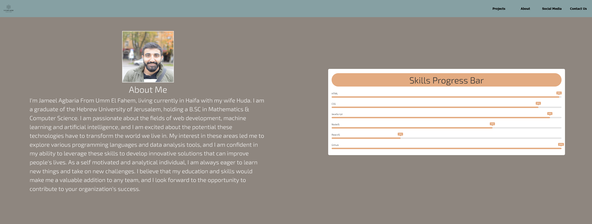

# My React Personal Portfolio

Welcome to my personal portfolio website built with React! This portfolio showcases my skills, projects, and provides an insight into my journey as a web developer.

## link- https://idyllic-tarsier-5a5ba6.netlify.app/

## Table of Contents

1. [Overview](#overview)
2. [Components](#components)
3. [Preview](#preview)

## Overview

This React-based personal portfolio is a representation of my work and skills. It includes various components such as a responsive header with navigation links, a visually appealing hero section, project showcase cards, a contact form, animations, social media icons, and an about section providing insights into my background, skills, and interests.

## Components

### 1. Header

The navigation bar is designed to be responsive, providing easy access to different sections of the portfolio.

### 2. Hero Section

The hero section welcomes visitors with a visually appealing design and a compelling tagline.

### 3. Cards

Project and skills showcase cards with titles, descriptions, and links for more details.

### 4. Footer

The footer includes my name, a copyright statement, and optional links to my social media profiles.

### 5. Contact Us Form

A user-friendly contact form with fields for name, email, and message.

### 6. Animations

Engaging animations are integrated throughout the portfolio for a visually appealing user experience.

### 7. Social Media Icons

Icons with links to my social media profiles for additional engagement.

### 8. About Section

The about section provides comprehensive information about me, my skills, and interests. A creative approach, such as a timeline, is used to present my journey.

### Preview 

